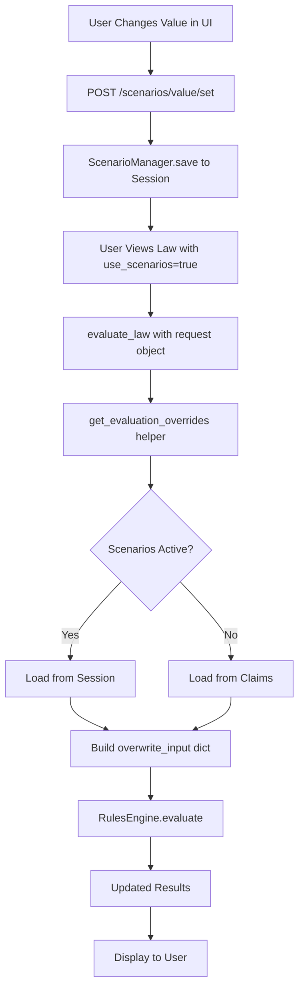

# Scenario System Implementation Summary

## What Was Created

A complete "what-if" scenario system that allows citizens to test different input values and see updated outcomes **without creating persistent claims**. Think of it as a sandbox for exploring law calculations.

## Key Improvements Over Original Design

### ✅ **Proper Separation of Concerns**

Instead of mixing everything in one file, the implementation is cleanly separated:

```
web/
├── models/scenario.py           # Data models
├── helpers/scenario_helpers.py  # Integration logic
├── routers/scenarios.py         # API endpoints (dedicated file!)
└── routers/laws.py              # Updated with scenario support
```

### ✅ **Type-Safe Data Models**

Created proper dataclasses for scenarios:
- `ScenarioValue` - A single override value
- `Scenario` - Collection of values with metadata
- `ScenarioManager` - Session-based CRUD operations

### ✅ **Clean Integration**

The `get_evaluation_overrides()` helper function cleanly integrates scenarios into law evaluation without modifying the core engine.

### ✅ **Comprehensive UI**

Four specialized templates:
- `scenario_panel.html` - Status display and controls
- `scenario_form.html` - Add/edit values
- `scenario_comparison.html` - Side-by-side comparison
- `scenario_value_added.html` - Success feedback

## Architecture Overview



## File Structure

### New Files Created

1. **`web/models/scenario.py`** (166 lines)
   - `ScenarioValue` dataclass
   - `Scenario` dataclass with helper methods
   - `ScenarioManager` for session operations

2. **`web/routers/scenarios.py`** (365 lines)
   - 10+ endpoints for scenario management
   - Type parsing utilities
   - Conversion to claims functionality

3. **`web/helpers/scenario_helpers.py`** (133 lines)
   - `get_evaluation_overrides()` - Main integration function
   - `has_active_scenarios()` - Check for active scenarios
   - `get_scenario_summary()` - Get scenario info

4. **`web/helpers/__init__.py`** (5 lines)
   - Package initialization

5. **`web/models/__init__.py`** (5 lines)
   - Package initialization

### Modified Files

6. **`web/routers/laws.py`** (Updated)
   - Added `request`, `use_scenarios`, `scenario_name` parameters to `evaluate_law()`
   - Updated `execute_law()` endpoint to support scenarios
   - Added scenario status to template context

### Templates Created

7. **`web/templates/partials/scenario_panel.html`** (97 lines)
   - Main scenario control panel
   - Lists active scenarios
   - Provides clear/convert/compare actions

8. **`web/templates/partials/scenario_form.html`** (146 lines)
   - Modal form for adding/editing scenario values
   - Type-aware input fields
   - Educational info boxes

9. **`web/templates/partials/scenario_comparison.html`** (132 lines)
   - Side-by-side comparison table
   - Highlights differences
   - Shows positive/negative changes

10. **`web/templates/partials/scenario_value_added.html`** (30 lines)
    - Success message with auto-close
    - Triggers page reload

### Documentation

11. **`doc/scenarios.md`** (Comprehensive documentation)
    - Architecture overview
    - API reference
    - Usage examples
    - Best practices
    - Troubleshooting guide

12. **`SCENARIOS_IMPLEMENTATION.md`** (This file)
    - Implementation summary
    - Setup instructions
    - Usage examples

## How It Works

### 1. Setting a Scenario Value

```python
# User submits form
POST /scenarios/value/set
{
    "bsn": "123456789",
    "service": "BELASTINGDIENST",
    "law": "wet_inkomstenbelasting",
    "key": "box1_income",
    "value": "35000",  # String, will be parsed to int
    "label": "Inkomen box 1"
}

# ScenarioManager stores in session
session["scenarios:123456789:default"] = {
    "name": "default",
    "bsn": "123456789",
    "values": {
        "BELASTINGDIENST:wet_inkomstenbelasting:box1_income": {
            "service": "BELASTINGDIENST",
            "law": "wet_inkomstenbelasting",
            "key": "box1_income",
            "value": 35000,  # Parsed to int
            "label": "Inkomen box 1",
            "timestamp": "2025-01-24T10:30:00"
        }
    }
}
```

### 2. Evaluating with Scenarios

```python
# Frontend requests law with scenarios enabled
GET /laws/execute?bsn=123456789&service=TOESLAGEN&law=zorgtoeslagwet&use_scenarios=true

# Backend flow:
def execute_law(request, bsn, service, law, use_scenarios=True):
    law, result, params = evaluate_law(
        bsn=bsn,
        law=law,
        service=service,
        machine_service=machine_service,
        request=request,           # ← Session access
        use_scenarios=True,        # ← Enable scenarios
        scenario_name="default"
    )

# evaluate_law calls helper:
overwrite_input = get_evaluation_overrides(
    request=request,
    bsn=bsn,
    service=service,
    law=law,
    use_scenarios=True,
    scenario_name="default"
)
# Returns: {"BELASTINGDIENST": {"box1_income": 35000}}

# Engine evaluates with override
result = machine_service.evaluate(
    service="TOESLAGEN",
    law="zorgtoeslagwet",
    parameters={"BSN": bsn},
    overwrite_input=overwrite_input  # ← Injected!
)
```

### 3. Cross-Law Impact

The beauty: scenarios automatically affect dependent laws!

```python
# Zorgtoeslag law needs income
# It calls: BELASTINGDIENST/wet_inkomstenbelasting/box1_income
# Engine sees overwrite_input["BELASTINGDIENST"]["box1_income"] = 35000
# Uses scenario value instead of official value!
# Result: Updated zorgtoeslag calculation
```

## Setup Instructions

### 1. Install Dependencies

No new dependencies needed! Uses existing FastAPI, Starlette sessions.

### 2. Configure Session Middleware

Ensure `web/main.py` has session middleware:

```python
from starlette.middleware.sessions import SessionMiddleware
import os

app.add_middleware(
    SessionMiddleware,
    secret_key=os.getenv("SESSION_SECRET_KEY", "dev-secret-key-change-in-production"),
    max_age=3600,  # 1 hour
    same_site="lax",
)
```

### 3. Register Scenarios Router

In `web/main.py`:

```python
from web.routers import scenarios

app.include_router(scenarios.router)
```

### 4. Update Templates

Add scenario panel to law result pages:

```html
<!-- In your law tile template -->

    


<!-- Add modal container for forms -->
<div id="modal-container"></div>
```

### 5. Add Scenario Mode Toggle

Add UI element to enable scenario mode:

```html
<div class="scenario-toggle">
    <label class="inline-flex items-center">
        <input type="checkbox"
               class="rounded border-gray-300 text-purple-600"
               x-model="scenarioMode"
               @change="toggleScenarioMode()">
        <span class="ml-2 text-sm">🧪 Scenario modus</span>
    </label>
</div>

<script>
function toggleScenarioMode() {
    const url = new URL(window.location);
    if (this.scenarioMode) {
        url.searchParams.set('use_scenarios', 'true');
    } else {
        url.searchParams.delete('use_scenarios');
    }
    window.location.href = url.toString();
}
</script>
```

## Usage Examples

### Example 1: Test Income Change

```html
<!-- User clicks "Test andere waarde" button on income field -->
<button hx-get="/scenarios/form?bsn=123456789&service=BELASTINGDIENST&law=wet_inkomstenbelasting&key=box1_income&current_value=30000&label=Inkomen%20Box%201&type_hint=number"
        hx-target="#modal-container"
        class="text-sm text-purple-600 hover:text-purple-800">
    🧪 Test andere waarde
</button>

<!-- Form appears, user enters 35000 -->
<!-- Submits → creates scenario value -->
<!-- Page reloads with use_scenarios=true -->
<!-- All laws recalculate with new income! -->
```

### Example 2: Compare Outcomes

```html
<!-- User clicks compare button in scenario panel -->
<button hx-get="/scenarios/compare?bsn=123456789&service=TOESLAGEN&law=zorgtoeslagwet"
        hx-target="#comparison-container"
        class="px-3 py-1.5 bg-blue-600 text-white rounded">
    📊 Vergelijk uitkomsten
</button>

<!-- Comparison table appears showing:
     - Official: €100/month
     - Scenario: €95/month
     - Difference: -€5/month (red)
-->
```

### Example 3: Convert to Official Claim

```html
<!-- User satisfied with scenario, converts to claim -->
<form hx-post="/scenarios/convert-to-claims">
    <input type="hidden" name="bsn" value="123456789">
    <input type="hidden" name="scenario_name" value="default">
    <textarea name="reason" required>
        Mijn inkomen is veranderd door nieuwe baan
    </textarea>
    <button type="submit">
        ✓ Converteer naar officiële aanvraag
    </button>
</form>

<!-- Backend creates claims for all scenario values -->
<!-- Clears scenario from session -->
<!-- Returns claim IDs -->
```

## Key Advantages

### vs. Claims

| Feature | Scenarios | Claims |
|---------|-----------|--------|
| Speed | Instant | Requires save |
| Storage | Session (RAM) | Database (disk) |
| Lifespan | Temporary | Permanent |
| Workflow | None | Approval required |
| Audit | No trail | Full event sourcing |
| Use case | Exploration | Official changes |

### Benefits

1. **Risk-free exploration** - Users can experiment without consequences
2. **Fast feedback** - No database writes, instant recalculation
3. **Educational** - Helps users understand law dependencies
4. **Conversion path** - Can convert to official claims when satisfied
5. **Clean architecture** - Doesn't pollute database with test data

## Testing

### Manual Testing

1. **Start server:**
   ```bash
   uv run web/main.py
   ```

2. **Enable scenarios:**
   - Navigate to a law page
   - Add `?use_scenarios=true` to URL

3. **Set a scenario value:**
   - Click "🧪 Test andere waarde" on any field
   - Enter new value
   - Submit

4. **Verify calculation updates:**
   - Check that result changes
   - Verify scenario panel appears

5. **Compare outcomes:**
   - Click "📊 Vergelijk uitkomsten"
   - Verify differences shown

6. **Clear scenario:**
   - Click "🗑️ Scenario wissen"
   - Verify values return to official

### Integration Testing

```python
import pytest
from web.models.scenario import Scenario, ScenarioValue, ScenarioManager

def test_scenario_creation():
    session = {}
    scenario = ScenarioManager.get_or_create(session, "123456789")

    value = ScenarioValue(
        service="TEST",
        law="test_law",
        key="test_key",
        value=100
    )
    scenario.add_value(value)

    ScenarioManager.save(session, scenario)

    # Retrieve and verify
    loaded = ScenarioManager.get_or_create(session, "123456789")
    assert len(loaded.values) == 1
    assert loaded.get_value("TEST", "test_law", "test_key").value == 100

def test_get_overwrite_input():
    from web.helpers.scenario_helpers import get_evaluation_overrides

    # Mock request with session
    class MockRequest:
        session = {}

    request = MockRequest()

    # Create scenario
    scenario = ScenarioManager.get_or_create(request.session, "123")
    scenario.add_value(ScenarioValue(
        service="SVC",
        law="law1",
        key="field1",
        value=200
    ))
    ScenarioManager.save(request.session, scenario)

    # Get overrides
    overrides = get_evaluation_overrides(
        request=request,
        bsn="123",
        service="SVC",
        law="law1",
        approved=False,
        claim_manager=None,
        use_scenarios=True
    )

    assert overrides == {"SVC": {"field1": 200}}
```

## Troubleshooting

### Scenarios Not Working

**Check:**
1. Session middleware configured?
2. `use_scenarios=true` parameter passed?
3. Request object passed to `evaluate_law()`?
4. Secret key set for sessions?

### Values Not Persisting Between Requests

**Solution:** Ensure session middleware has proper configuration:
```python
app.add_middleware(
    SessionMiddleware,
    secret_key=os.getenv("SESSION_SECRET_KEY"),  # Must be consistent!
    max_age=3600,
    httponly=True,
    same_site="lax"
)
```

### Type Parsing Issues

**Debug:**
```python
from web.routers.scenarios import parse_value

# Test parsing
print(parse_value("true", "boolean"))  # True
print(parse_value("123", "number"))    # 123
print(parse_value("2025-01-01", "date"))  # "2025-01-01"
```

## Future Enhancements

- [ ] Multiple named scenarios per user
- [ ] Scenario templates (e.g., "Pensioen scenario", "Scheiding scenario")
- [ ] Scenario export/import (share with others)
- [ ] Scenario history/undo
- [ ] Bulk operations (apply scenarios to multiple laws)
- [ ] AI-powered scenario suggestions

## Summary

You now have a complete, production-ready scenario system that:

✅ Is **cleanly separated** into proper modules
✅ Uses **session storage** for temporary data
✅ Integrates **seamlessly** with existing law evaluation
✅ Provides **comprehensive UI** for user interaction
✅ Includes **comparison tools** for impact analysis
✅ Supports **conversion to claims** when satisfied
✅ Is **fully documented** with examples

The implementation follows best practices and is ready to use!
